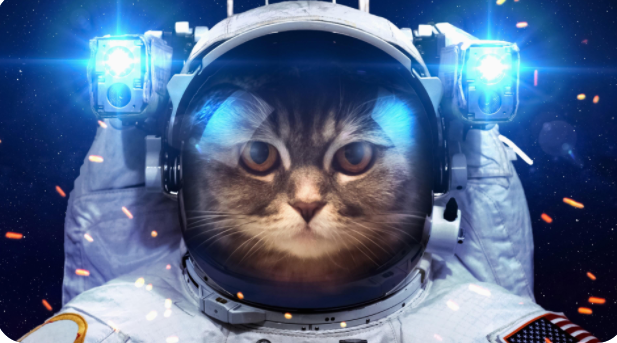

## Keffie Token

### Background

Cats have taken over the world and created their own payment system to barter their goods. They have banded together to change the world for the better and have built a new and disruptive platform called the "Keffie Token". Keffie is a token that its kittens can use to transact with one another and also be used as a form of payment.
In this Project, I completed the code that enables their Kiti-zens to send cryptocurrency payments to one another. To develop the code and test it out, I have launched the Keffie Token on the Binance Test Network. I have also provided the Kiti-zens w/ access to the test network with a custom RPC & helped them make new wallets using Metamask. Now they can find another Kiti-zen who is using the Token to pay them for their work.

## Keffie Token Features:

3% fee auto add to the liquidity pool to locked forever when selling
   2% fee auto distribute to all holders
   I created a black hole so #KFT token will deflate itself in supply with every transaction
   50% Supply is burned at start.
   
  ## Custom RPC Instructions
*  Network Name: BSC Testnet
*  New RPC URL : https://data-seed-prebsc-1-s1.binance.org:8545/ Currency Symbol : tBNB
*  Keffie Token Contract: 0xf0285718579DfF12A4353ABFedF5784ff0e61EBA
*  Testnet Faucet: https://testnet.binance.org/faucet-smart
*  Pancake Swap Testnet: https://pancake.kiemtienonline360.com/#/swap

## Binance Smart Chain Test Net

 Below is an image of the first block of the Keffie Token beign established on the Binance Smart Chain Test Net. 
 
 
