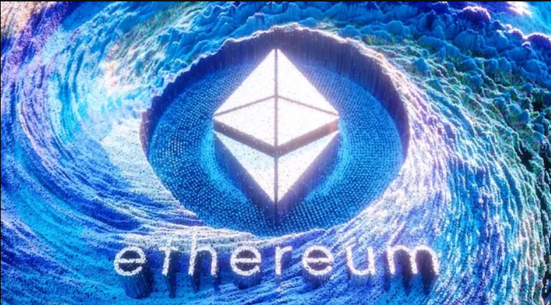

# Solidity

# Solidity language for Ethereum sSmart Contracts

Solidity is a statically-typed curly-braces programming language designed for developing smart contracts
that run on the Ethereum Virtual Machine. Smart contracts are programs that are executed inside a peer-to-peer
network where nobody has special authority over the execution, and thus they allow to implement tokens of value,
ownership, voting, and other kinds of logic.

This repository will hold examples of using solidity code to display the use of:
* Executing transactions
* Making crypto wallets using Ganach & the Truffel Suite 
* Launching Teste Net tokens on the Ethereum blockchain as well as BNB & AVAX
